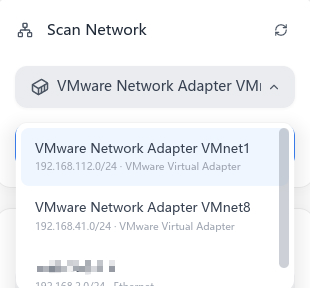
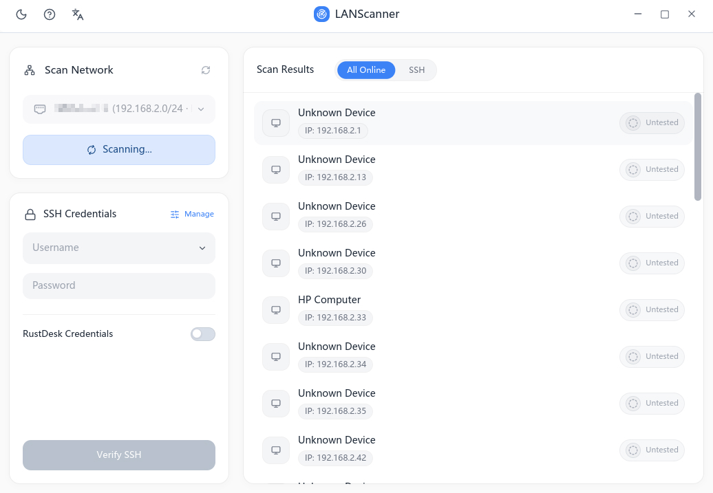
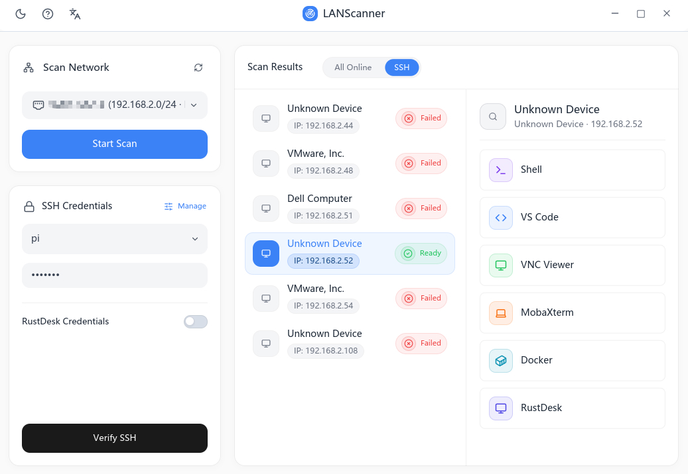

<p align="center">
  <a href="./README_CN.md">中文</a> | English
</p>
<h1 align="center"> LANScanner</h1>

**Your ultimate toolkit for LAN discovery and SSH management.**

Welcome to LANScanner, a powerful, blazing-fast, and elegant network utility built for developers, system administrators, and IT enthusiasts who care deeply about performance and a clean user experience.

If you are tired of jumping between different command-line tools just to find IP addresses, inspect open ports, or manage SSH access, LANScanner solves that problem with an all-in-one graphical interface that keeps your local network workflow under control.

### Why LANScanner?

- 🚀 **High-speed scanning:** Powered by Rust and the asynchronous networking stack `tokio`, LANScanner can scan your subnet and discover active devices in seconds.
- 🎨 **Modern and intuitive UI:** Built with `Iced`, it provides a responsive and polished graphical interface that makes network management feel straightforward instead of tedious.
- 🔐 **Seamless SSH credential management:** Manage SSH credentials directly inside the app and connect to your servers with a single click. No more digging through config files or forgetting passwords.
- 🐳 **Docker and service detection:** Intelligently detects Docker containers and running services so you can better understand what is actually active on your network.
- 🛠 **Ready out of the box:** No complex setup required. Launch the app, pick a network interface, and start scanning.

---

## Downloads

- Release overview: https://github.com/ChickmagnetL/LANScanner/releases/latest
- Windows download: https://github.com/ChickmagnetL/LANScanner/releases/latest/download/LANScanner-windows-x86_64.zip
- macOS download: [Coming soon...]
- Linux download: [Coming soon...]

---

## 🚀 Usage

1. **Launch the application.**

2. **Choose a network:** In the "Scan Networks" tab on the left side of the application interface, click the drop-down box and select the network interface you want to scan.

   <p align="center"></p>

3. **Start scanning:** Click the scan button and watch devices, open ports, and detected services appear in real time.

   <p align="center"></p>

4. **Connect to a device:**

   - Enter the username and password in the SSH credential panel on the left, or save SSH usernames and passwords/keys with the built-in credential manager. Then click the SSH credential verification button below.
   - Click a verified device to view the available quick-launch connection applications.
   - Click an icon in the right-side panel to open the corresponding application and connect to that device IP immediately.

   <p align="center"></p>

---

## 🏗 Architecture

LANScanner is organized as a modular Cargo workspace so the codebase stays maintainable, responsibilities stay clearly separated, and future expansion remains straightforward. The project is mainly split into the following crates:

- **`crates/app`**: The main application entry point and coordinator. It combines business logic with the user interface and handles top-level app state, message routing, and shell integration.
- **`crates/core`**: The core engine of the application. It contains the heavy lifting for network scanning, SSH protocol handling with `russh`, Docker detection, and credential management. This layer is logic-focused and independent from the UI.
- **`crates/platform`**: Handles OS-specific integrations and system-level operations, including network interface discovery, launching terminal emulators or external applications, and window/process management.
- **`crates/ui`**: The presentation layer. It is built entirely with `Iced` and contains reusable widgets, themes, device lists, scan cards, and modal dialogs.

---

## 🛠 Build

To simplify the build process, LANScanner uses one-click build scripts instead of a long series of manual commands.

1. **Clone the repository and enter the project directory:**

   ```bash
   git clone https://github.com/ChickmagnetL/LANScanner.git
   cd LANScanner
   ```

2. **Run the build script:**
   All automated build scripts are grouped under `tools/build/`. Run the script for your operating system to build and package the application automatically. At the moment, the Windows build script is available, so you can start with `windows.ps1`.

*Note: one-click build scripts for macOS and Linux will be added later to improve the cross-platform build workflow.*

---

## 🗺 Roadmap

The near-term roadmap currently includes:

- [ ] 🍎 **macOS support**
- [ ] 🐧 **Linux support**

## Acknowledgments

[Linux.Do](https://linux.do/) Community
