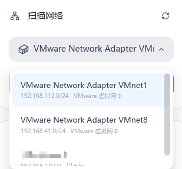
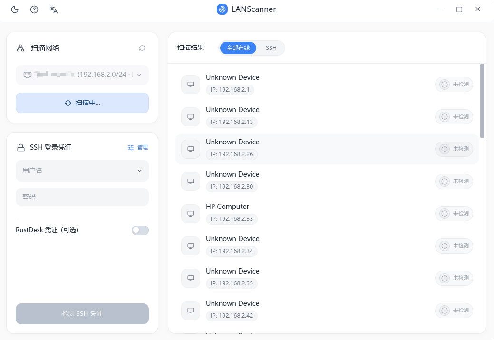
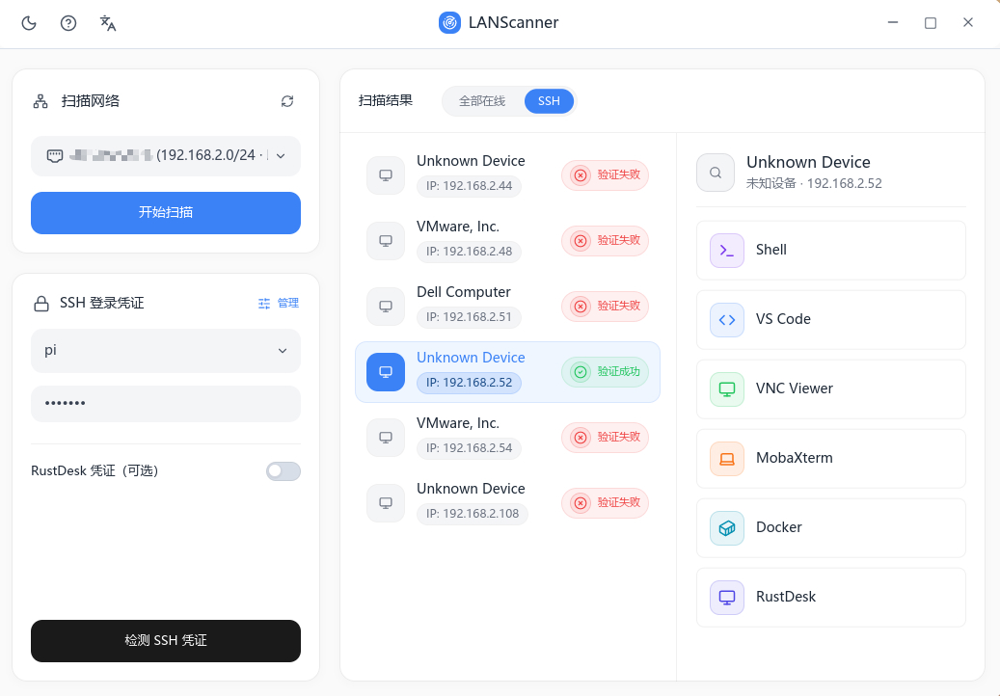

<p align="center">
  中文 | <a href="./README.md">English</a>
</p>
<h1 align="center"> LANScanner</h1>

**发现局域网设备，验证 SSH，并一键打开 VS Code、终端、VNC 或 RustDesk。**

LANScanner 不只是一个局域网扫描器。它把“找设备、确认能不能连、用熟悉的工具打开它”串成一条顺手的桌面流程，省去手动查 IP、试端口、反复输凭据和来回切应用。

如果你经常在开发板、小主机、树莓派、NAS 或服务器之间切换，LANScanner 可以帮你更快知道哪台机器在线、哪台可以用 SSH 登录，接下来选一个趁手的远程工具进行一键连接。

### 为什么选择 LANScanner？

-  🚀 **一键远程：** 扫描到设备后，应用内可直接拉起 VS Code、终端、VNC 或 RustDesk，不用手动复制 IP 地址。
- 🔐 **验证通过后快速连接：** SSH 凭证验证成功后，可直接从应用内发起连接，免密直接登录上述远程软件，减少重复输入和来回换。
- ⚡**体验快如闪电：**基于 Rust 构建，无论是界面反馈，还是局域网扫描速度都保持轻快流畅。
- 🗂 **SSH 凭证管理：**常用用户名、密码可集中保存和管理，连接多台设备时更高效。
- 🖥 **上手直接：**符合人类直觉的排版设计，打开应用的第一眼就知道如何操作，仿佛天生就会。
- 🐳 **docker 容器连接：**可检测到目标设备的 docker 环境，支持对 docker 容器的一键远程登录（通过 Vscode 的 Dev Containers扩展）。

---

## 此处下载

- 下载总览：https://github.com/ChickmagnetL/LANScanner/releases/latest
- Windows 下载：https://github.com/ChickmagnetL/LANScanner/releases/latest/download/LANScanner-windows-x86_64.zip
- macOS 下载：https://github.com/ChickmagnetL/LANScanner/releases/latest/download/LANScanner-macos.dmg
- Linux 下载：https://github.com/ChickmagnetL/LANScanner/releases/latest/download/LANScanner-linux-x86_64.AppImage

---

## 🚀 使用说明

1. **启动应用。**

2. **选择网络：** 在应用界面左侧的扫描网络卡片中，点击下拉框，选择你想要扫描的网络接口。

   <p align="center"></p>

3. **开始扫描：** 点击扫描按钮。见证设备、开放端口和服务在列表中实时弹出的过程。

   <p align="center"></p>

4. **连接设备：**

   - 在左侧 SSH 登录凭证栏填写用户名和密码，或者使用内置的凭据管理器保存 SSH 用户名和密码/密钥。然后点击下方的检测 SSH 凭证。
   - 点击通过验证的设备，以查看可供使用的快速连接应用选项。
   - 只需点击一下右侧栏的图标，即可快速打开对应的应用，并连接此 IP 设备。

   <p align="center"></p>

---

## 🏗 架构说明

LANScanner 经过精心设计，采用模块化的 Workspace 架构，以确保代码的可维护性、清晰的关注点分离以及未来的可扩展性。项目主要分为以下几个专门的 crate：

- **`crates/app`**: 应用程序的主要入口和协调者。它将业务逻辑与用户界面结合在一起，处理主要的应用状态、消息路由和 shell 集成。
- **`crates/core`**: 应用程序的核心心脏。包含网络扫描、SSH 协议处理 (`russh`)、Docker 检测和凭据管理的所有繁重工作。这部分纯粹由逻辑驱动，与 UI 无关。
- **`crates/platform`**: 处理特定操作系统的集成和系统级操作。包括查找网络接口、启动终端模拟器或外部应用，以及窗口和进程管理。
- **`crates/ui`**: 视觉展示层。完全使用 `Iced` 构建，包含可重用的组件（widgets）、主题、设备列表、扫描卡片和模态对话框。

---

## 🛠 构建说明

有需求修改应用的用户，在修改完代码之后可以使用项目里提供的一键构建应用脚本，这种方式极大地简化编译过程。

1. **克隆仓库并进入目录：**

   ```bash
   git clone https://github.com/ChickmagnetL/LANScanner.git
   cd LANScanner
   ```

2. **使用构建脚本：**
   所有自动化构建脚本都统一存放在 `tools/build/` 目录下。Windows 环境使用 `windows.ps1`，macOS 环境使用 `macos.sh`，Linux 环境使用 `linux.sh`。

---

## 🗺 未来计划

近期的项目路线图主要包括：

- [x] **适配 macOS 平台 **
- [x] **适配 Linux 平台 🐧**

------

## 致谢

[Linux.Do](https://linux.do/) 社区
